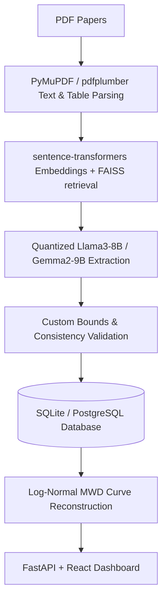

# PolyTrace Project & AI Skills Analysis

An analysis of the PolyTrace project specifications and the available AI skills.

---

## 1. PolyTrace Project Overview

**PolyTrace** (detailed in [NCL_Polymer_Project.md](file:///home/nkandasamy/Desktop/PolyTrace/docs/NCL_Polymer_Project.md)) is an experimental data-extraction and visualization pipeline for Polymer Molecular Weight Distributions (MWD). 

### Key Objectives
*   **Target Polymers**: Polyethylene (HDPE, LDPE) and Polypropylene (PP, categorized by tacticity).
*   **Core Properties to Extract**: Mn, Mw, dispersity ($\text{Đ} = Mw/Mn$), processing methods, mechanical properties, chemical composition, and operational parameters.
*   **Database Storage**: SQLite for development and PostgreSQL for production.
*   **MWD Curve Reconstruction**: Log-normal distribution reconstruction based on extracted Mn and Mw.
*   **Web Dashboard**: A two-tier application consisting of a **FastAPI backend** and a **React + Plotly frontend**.

### Technical Pipeline

### Remaining Open Questions / Uncertainties
*   Availability of a **seed set of papers** to test the pipeline.
*   Target database delivery format (e.g., hosted PostgreSQL vs. portable SQLite file).
*   Priority order of journals (Elsevier, ACS, Wiley, RSC).
*   Whether full curve extraction from figures is a required feature or a stretch goal.

---

## 2. AI Skills Analysis

The `ai-skills/` directory contains standard behaviors and skills designed to guide AI agents in executing tasks. Below is an overview of how they align with the PolyTrace project:

### 2.1 Core Orchestration Instructions
*   **Files**: [AGENTS.md](file:///home/nkandasamy/Desktop/PolyTrace/ai-skills/AGENTS.md), `Agents.md`, `CLAUDE.md`, `GEMINI.md`
*   **Framework**: Establishes a **3-layer architecture**:
    1.  **Directive (What)**: Step-by-step SOPs in `directives/` (Markdown).
    2.  **Orchestration (Routing)**: The model's decision-making loop.
    3.  **Execution (Doing)**: Deterministic, testable Python scripts in `execution/`.
*   **Behavioral Constraints**: Strong emphasis on token conservation (e.g., `grep_search` before `view_file`, concise responses, and batching edits).
*   **Alignment Issue**: **Section 5 of these files currently references a different project (`SoundWave / StemFlow`, an Android app with Kotlin/ExoPlayer/ONNX)**. This section needs to be updated or pruned to prevent the agent from using incorrect project paths or build instructions during execution.

### 2.3 Specialized Skills
1.  **`skill-creator`**:
    *   **Purpose**: Meta-skill to build, test, and benchmark other skills with assertions and a local viewer script.
    *   **Usefulness**: High. Useful if we need to draft custom extraction or validation skills later.
2.  **`frontend-design`**:
    *   **Purpose**: Directives for creating beautiful, custom, high-end user interfaces while avoiding generic templates.
    *   **Usefulness**: Very High. This will guide the design of the React dashboard to ensure a premium look (using custom fonts, css grids, HSL palettes, and micro-animations).
3.  **`github-helper`**:
    *   **Purpose**: Automates Git commands and conventional commits.
    *   **Usefulness**: Moderate. Helpful for project version control.
4.  **`android-app-tester`**:
    *   **Purpose**: Android building, testing, and ADB debugging instructions.
    *   **Usefulness**: Low/None. PolyTrace is a Python-FastAPI and React-web project, not an Android app. This skill is legacy context and can be safely ignored.

---

## 3. Recommended Immediate Steps & Status

To align the AI skills and project structure for development:

1.  **Prune/Update `AGENTS.md` (and mirrors)**:
    *   [x] Replace Section 5 ("Project Context — SoundWave / StemFlow") with the PolyTrace project context.
    *   [x] Mirror files to the root directory (`AGENTS.md`, `CLAUDE.md`, `GEMINI.md`).
2.  **Initialize Project Folders**:
    *   [x] Create `directives/`, `execution/`, and `.tmp/` directories to follow the 3-layer architecture pattern.
    *   [x] Add a proper root-level `.gitignore` for Python, React, SQLite, and agent metadata files.
    *   [ ] Create `backend/` and `frontend/` directories for the application code.
3.  **Address Open Questions (Meeting this Friday — 4 days away)**:
    *   [ ] Prepare a list of concrete queries/options to present to Dr. Kavita Joshi (e.g. database hosting choice, journal priorities, seed paper status, curve extraction requirements) to finalize these specs at the meeting.
